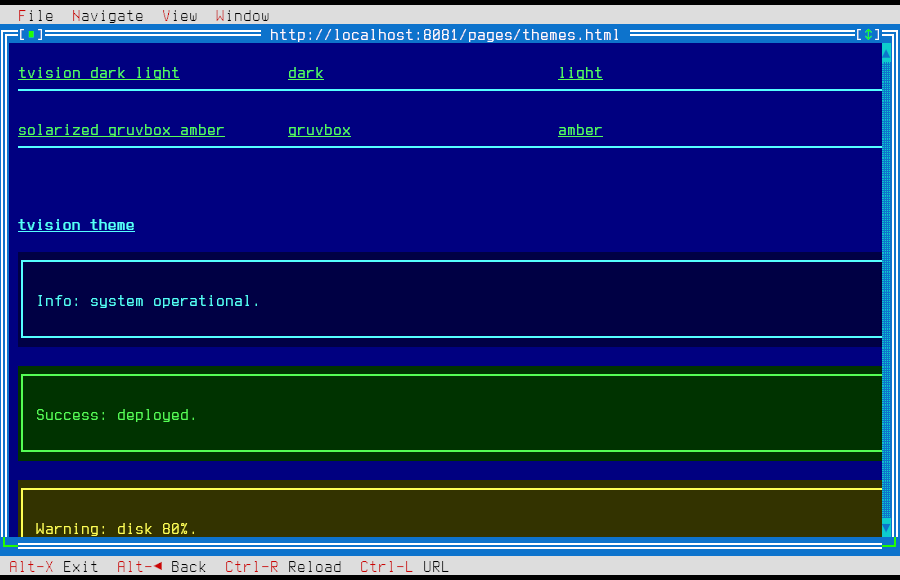
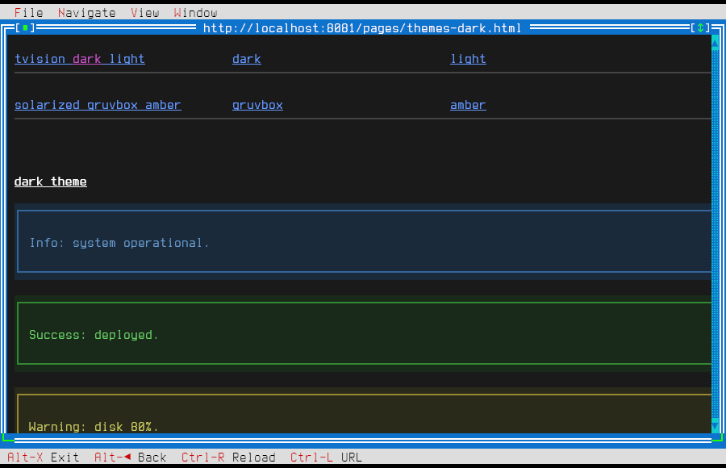
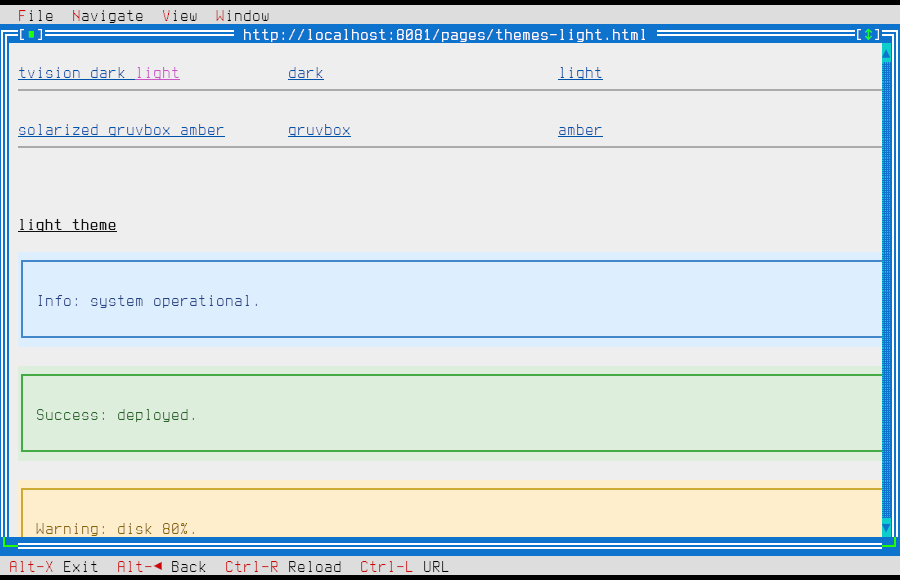
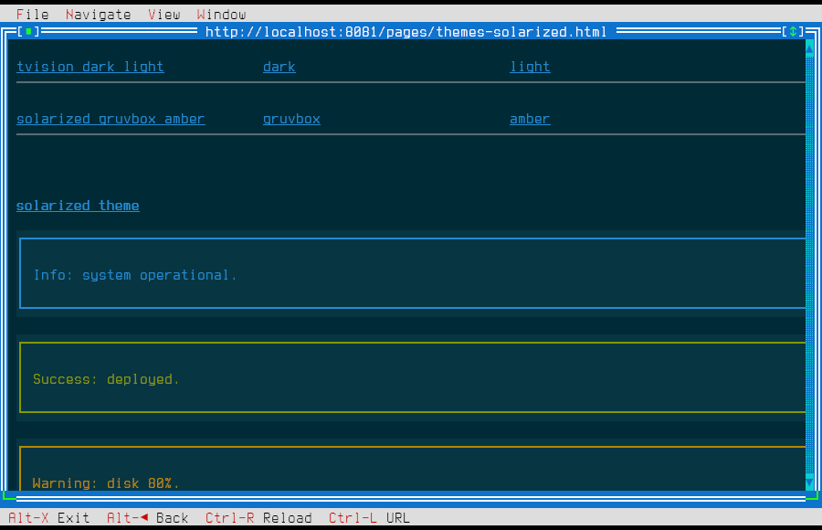
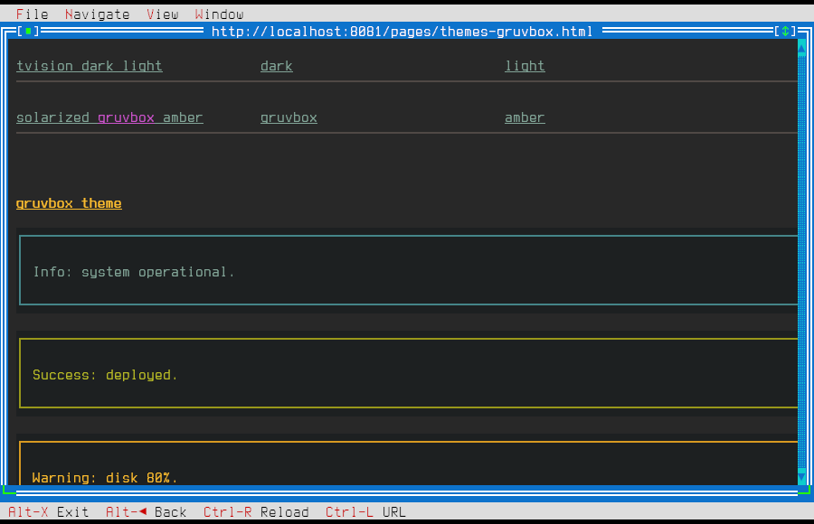
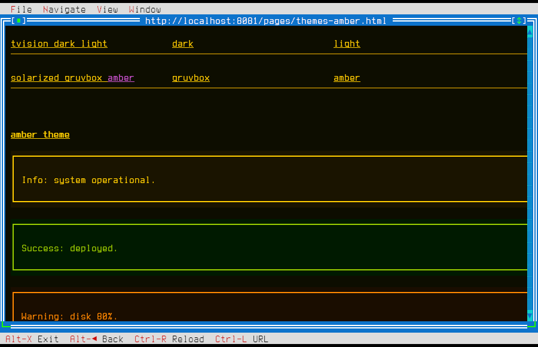

# tvshow — Server Author Guide

This guide is for developers building HTTP servers or web applications whose output is consumed by tvshow. It covers what HTML and CSS tvshow understands, how it maps them to character cells, and how to get the best rendering results.

---

## How tvshow consumes a page

tvshow fetches a URL with HTTP GET. It expects `Content-Type: text/html` (with optional `charset=`). It parses the document with Gumbo (an HTML5 parser), resolves CSS from `<link>` and `<style>` tags, lays out the result into a character-cell grid, and renders it using box-drawing glyphs and truecolor terminal attributes.

Each character cell is one column wide and one row tall. The browser window is typically 80–132 columns × 24–50 rows, depending on the terminal size and the number of open tabs.

### Pixel-to-cell mapping

tvshow maps CSS pixel values to cell coordinates using:

| Axis | Ratio |
|------|-------|
| Horizontal | 8 px = 1 column |
| Vertical | 16 px = 1 row |

Fractional values round half-up. This ratio affects `width`, `height`, `margin`, `padding`, `border-width`, `gap`, `flex-basis`, and image `width`/`height` attributes.

---

## Supported HTML (v1)

### Document structure

```html
<!doctype html>
<html>
  <head>
    <meta charset="utf-8">
    <title>Page title</title>
    <link rel="stylesheet" href="/style.css">
    <style> /* inline CSS */ </style>
  </head>
  <body>
    <!-- content -->
  </body>
</html>
```

### Block-level elements

`div`, `p`, `h1`–`h6`, `hr`, `pre`, `blockquote`, `section`, `article`, `header`, `footer`, `nav`, `main`, `ul`, `ol`, `li`.

### Inline elements

`span`, `a`, `b`, `strong`, `i`, `em`, `u`, `code`, `br`, `small`.

### Forms

| Element | Notes |
|---------|-------|
| `<form action method>` | `method="get"` or `method="post"` |
| `<input type="text">` | Single-line text |
| `<input type="password">` | Characters hidden |
| `<input type="checkbox">` | Toggled with Space |
| `<input type="radio">` | Grouped by `name` |
| `<input type="submit">` | Submits the form |
| `<input type="hidden">` | Not rendered, value submitted |
| `<textarea>` | Multi-line, scrolls on overflow |
| `<select>` + `<option>` | Opens as a dropdown dialog |
| `<button>` | Focusable, submits on Enter |
| `<label>` | Associates with control via `for` |

Form encoding: `application/x-www-form-urlencoded` (the default). `enctype="multipart/form-data"` is not supported in v1.

### Images

```html

```

tvshow renders `[alt text]` in the space reserved by `width` × `height` (converted to cells via the px→cell ratio). The `src` is not fetched in v1.

If `width`/`height` are absent, the reserved space defaults to `alt.length + 2` columns × 1 row.

### Out of scope — graceful fallback

These tags are parsed but their rendering is degraded:

| Tag | Fallback |
|-----|---------|
| `<table>`, `<tr>`, `<td>`, `<th>` | Rendered via flex layout with cross-row column alignment |
| `<script>` | Entirely ignored |
| `<iframe>`, `<video>`, `<audio>`, `<canvas>`, `<svg>` | Entirely ignored |

---

## Supported CSS (v1)

### Sources and cascade

tvshow applies CSS from these sources in cascade order (lowest to highest precedence):

1. User-agent stylesheet (built-in)
2. `<link rel="stylesheet" href="...">` (HTTP-fetched)
3. `<style>` blocks
4. Inline `style="..."`

Specificity and `!important` follow the CSS spec.

### Selectors

| Selector type | Example |
|--------------|---------|
| Tag | `p`, `div`, `h1` |
| Class | `.card`, `.btn-primary` |
| ID | `#header`, `#nav` |
| Descendant | `nav a`, `div p` |
| Child | `ul > li` |
| Attribute existence | `input[required]` |
| Pseudo-class | `:focus` (focused links/controls), `:hover` (mouse-over) |

### Honored properties

**Color**

| Property | Values |
|----------|--------|
| `color` | Any CSS color (named, `#rgb`, `#rrggbb`, `rgb()`, `rgba()`) |
| `background-color` | Same |
| `background` | Color shorthand only; images ignored |

Alpha is discarded in v1. Colors are mapped to truecolor, 256-color, or 16-color depending on terminal capability — detected automatically at startup.

**Text**

| Property | Values |
|----------|--------|
| `font-weight` | `normal`, `bold` |
| `font-style` | `normal`, `italic` |
| `text-decoration` | `none`, `underline`, `line-through` |
| `text-align` | `left`, `right`, `center` |
| `white-space` | `normal`, `pre`, `nowrap` |

**Box model**

| Property | Values |
|----------|--------|
| `width`, `height` | `px`, `%`, `ch` |
| `min-width`, `max-width` | `px`, `%`, `ch` |
| `margin` | shorthand and individual sides, `px`, `%`, `auto` |
| `padding` | shorthand and individual sides, `px`, `%` |
| `border` | shorthand |
| `border-style` | `none`, `solid`, `double`, `dashed`, `dotted`* |
| `border-color` | Any CSS color |
| `border-width` | `px` (any value > 0 becomes 1 cell; 0 collapses to `none`) |

*`dotted`, `ridge`, `groove`, `inset`, `outset` fall back to `solid`.

**Display and layout**

| Property | Values |
|----------|--------|
| `display` | `block`, `inline`, `inline-block`, `flex`, `none` |
| `position` | `static`, `relative`, `absolute` |
| `top`, `right`, `bottom`, `left` | `px`, `%`, `ch` (used with `relative`/`absolute`) |
| `visibility` | `visible`, `hidden` |
| `overflow` | `visible`, `hidden`, `scroll`, `auto` |
| `flex-direction` | `row`, `column` |
| `justify-content` | `flex-start`, `flex-end`, `center`, `space-between`, `space-around` |
| `align-items` | `flex-start`, `flex-end`, `center`, `stretch` |
| `gap` | single value, `px` |
| `flex-grow`, `flex-shrink` | number |
| `flex-basis` | `px`, `%`, `auto` |

Flex wrapping (`flex-wrap`) is not supported; flex containers always behave as `nowrap`.

### CSS units

| Unit | Meaning |
|------|---------|
| `px` | Pixels, converted via 8 px = 1 col / 16 px = 1 row |
| `ch` | 1 column |
| `em` | 1 row (font size has no effect in a monospace terminal) |
| `rem` | 1 row |
| `%` | Percentage of containing block's content area |

### Ignored properties

Any property not listed above is parsed (so `style="..."` attributes don't error) but not applied. This includes: `font-size`, `font-family`, `line-height`, `letter-spacing`, `opacity`, `border-radius`, `box-shadow`, `background-image`, `transform`, `transition`, `animation`, and everything in CSS Grid.

---

## Borders and box-drawing glyphs

tvshow draws CSS borders using Unicode box-drawing characters:

| `border-style` | Characters used |
|----------------|-----------------|
| `solid` | `┌ ┐ └ ┘ ─ │` |
| `double` | `╔ ╗ ╚ ╝ ═ ║` |
| `dashed` | `┌ ┐ └ ┘ ╌ ╎` |
| `dotted` | falls back to `solid` |
| `none` | no characters drawn, no cell reserved |

Border width is always 1 cell regardless of the `px` value. Setting `border-width: 0` collapses to `none`.

**Rendered example:**

```html
<div style="border: solid; padding: 1ch;">Solid border</div>
<div style="border: double; padding: 1ch;">Double border</div>
<div style="border: dashed; padding: 1ch;">Dashed border</div>
```

```
┌─────────────────────────────────────────────────────────┐
│ Solid border                                            │
└─────────────────────────────────────────────────────────┘

╔═════════════════════════════════════════════════════════╗
║ Double border                                           ║
╚═════════════════════════════════════════════════════════╝

┌╌╌╌╌╌╌╌╌╌╌╌╌╌╌╌╌╌╌╌╌╌╌╌╌╌╌╌╌╌╌╌╌╌╌╌╌╌╌╌╌╌╌╌╌╌╌╌╌╌╌╌╌╌╌╌╌╌┐
╎ Dashed border                                           ╎
└╌╌╌╌╌╌╌╌╌╌╌╌╌╌╌╌╌╌╌╌╌╌╌╌╌╌╌╌╌╌╌╌╌╌╌╌╌╌╌╌╌╌╌╌╌╌╌╌╌╌╌╌╌╌╌╌╌┘
```

---

## Tips for targeting tvshow

**Rendered examples**

Typography — `h1`–`h3` with inline emphasis:

```html
<h1>Page Title</h1>
<h2>Section Heading</h2>
<p>Normal text with <strong>bold</strong> and <em>italic</em> spans.
A <a href="/next">link</a> renders highlighted when focused.</p>
<pre>  preformatted
  text block</pre>
```

```
Page Title
══════════════════════════════════════════════════════════════

Section Heading
──────────────────────────────────────────────────────────────

Normal text with bold and italic spans. A link renders
highlighted when focused.

  preformatted
  text block
```

Flex row layout:

```html
<div style="display:flex; justify-content:space-between; gap:2ch;">
  <div style="border:solid; padding:1ch; flex-grow:1;">Alpha</div>
  <div style="border:solid; padding:1ch; flex-grow:1;">Beta</div>
  <div style="border:solid; padding:1ch; flex-grow:1;">Gamma</div>
</div>
```

```
┌──────────────────┐ ┌──────────────────┐ ┌──────────────────┐
│ Alpha            │ │ Beta             │ │ Gamma            │
└──────────────────┘ └──────────────────┘ └──────────────────┘
```

---

**Use explicit widths in cells, not pixels.** `width: 40ch` is exactly 40 columns. `width: 320px` is 40 columns (320 ÷ 8). Both are fine; `ch` is clearer.

**Prefer `color` and `background-color` over gradients or images.** Gradients and background images are silently ignored.

**Use `border-style: solid` or `double` for structure.** These look intentional in a terminal. Rounded corners don't exist; `border-radius` is ignored.

**Keep line lengths predictable.** The viewport is typically 80–132 columns. Content wider than the viewport clips; there is no horizontal scrollbar in v1.

**Test with `white-space: pre` for code blocks.** `<pre>` elements get `white-space: pre` by default, preserving indentation and newlines.

**Anchor fragments work.** `<a href="#section">` navigates to the element with `id="section"`. Give important sections an `id` attribute.

**Forms follow standard semantics.** Name your inputs with `name` attributes. The `action` URL receives a standard `application/x-www-form-urlencoded` body on POST.

---

## HTTP response requirements

| Header | Required value |
|--------|---------------|
| `Content-Type` | `text/html` (with optional `; charset=utf-8`) |

tvshow follows HTTP redirects (`301`, `302`, `303`, `307`, `308`) up to 5 hops. Error responses (`4xx`, `5xx`) are displayed as built-in error pages.

Character encoding: UTF-8 is assumed if not specified in `Content-Type` or a `<meta charset>` tag.

---

## Themes

tvshow ships three CSS themes optimized for terminal rendering. Link one from the demo server or copy it into your own project:

```html
<link rel="stylesheet" href="/styles/tvision.css">
<!-- or: dark.css, light.css -->
```

| Theme | Look |
|-------|------|
| `tvision` | Classic TurboVision — cyan/yellow on dark blue, double borders |
| `dark` | Modern dark — white on near-black, subtle borders |
| `light` | Light — dark text on white/grey, clean borders |
| `solarized` | Solarized Dark — iconic low-contrast palette, blue/teal/green accents |
| `gruvbox` | Gruvbox Dark — warm earthy tones, yellow/green/teal accents |
| `amber` | Amber phosphor CRT — monochrome retro, single amber hue, double borders |

### Provided CSS classes

All six themes share the same class names:

**Layout:** `.row`, `.col`, `.grow`, `.center`, `.right`

**Components:**
| Class | Purpose |
|-------|---------|
| `.panel`, `.card` | Bordered container with padding |
| `.panel-title`, `.card-title` | Bold heading inside a panel/card |
| `.btn` | Default button |
| `.btn-primary` | Primary action button |
| `.btn-danger` | Destructive action button |
| `.nav` | Horizontal flex nav bar with bottom border |
| `.alert` | Bordered message box |
| `.alert-info`, `.alert-success`, `.alert-warning`, `.alert-error` | Colored alert variants |
| `.form-group` | Block wrapper for form field + label |
| `.form-label` | Bold label above a form control |
| `.muted` | Dim secondary text |
| `.bold` | Bold text |

**Example — dashboard with tvision theme:**

```html
<!doctype html>
<html>
<head>
  <title>Dashboard</title>
  <link rel="stylesheet" href="/styles/tvision.css">
</head>
<body>
  <div class="nav">
    <a href="/">Home</a>
    <a href="/status">Status</a>
  </div>
  <h1>Dashboard</h1>
  <div class="alert alert-success">All systems operational.</div>
  <div class="row">
    <div class="card grow">
      <p class="card-title">CPU</p>
      <p>42%</p>
    </div>
    <div class="card grow">
      <p class="card-title">Memory</p>
      <p>2.1G / 8G</p>
    </div>
  </div>
</body>
</html>
```

---

## PHP helper library

`server/php/` ships a zero-dependency PHP 8.1+ library that generates tvshow-compatible HTML by construction. It enforces correct units, theme class names, and form encoding so you don't have to track the subset manually.

### Installation (Composer)

```sh
composer require tvshow/php
# — or point composer.json at the local path:
# "repositories": [{"type": "path", "url": "path/to/server/php"}]
```

Without Composer, `require_once` the three source files directly (see examples).

### API overview

**`Page`** — full document builder:

```php
use Tvshow\Page;

$page = new Page('Dashboard', Page::THEME_TVISION);
$page->body(/* ...strings... */);
echo $page->render();
```

Themes: `Page::THEME_TVISION`, `Page::THEME_DARK`, `Page::THEME_LIGHT`, or `null` for no built-in stylesheet.

**`Html`** — element and layout helpers (all return strings):

```php
use Tvshow\Html;

Html::h1('Title')
Html::p('Text', 'class')
Html::a('/path', 'Label')
Html::div($content, $class, $style)
Html::ul(['item 1', 'item 2'])
Html::img('/img.png', 'Alt text', 320, 160)   // width/height in px, snapped to cell grid

// theme-class shortcuts
Html::nav([Html::a('/', 'Home'), Html::a('/about', 'About')])
Html::row([Html::card('CPU', Html::p('42%')), Html::card('Memory', Html::p('2G'))])
Html::card('Title', $body)
Html::panel('Title', $body)
Html::alert('Message', 'success')   // types: info|success|warning|error
Html::muted('secondary text')
Html::bold('emphasis')
```

**`Form`** — form controls:

```php
use Tvshow\Form;

Form::open('/login', 'post')           // enctype always omitted (no multipart)
Form::group('Label', Form::text('name'))
Form::text('name', $value, $placeholder, $id)
Form::password('name')
Form::textarea('name', $rows, $value)
Form::checkbox('name', '1', $checked, 'Label')
Form::radio('name', 'value', $checked, 'Label')
Form::select('name', ['a' => 'Option A', 'b' => 'Option B'], $selected)
Form::hidden('token', $csrf)
Form::submit('Login', 'btn btn-primary')
Form::close()
```

### Full example

```php
<?php
use Tvshow\Html, Tvshow\Form, Tvshow\Page;

$page = new Page('Dashboard', Page::THEME_TVISION);
$page->body(
    Html::nav([Html::a('/', 'Home'), Html::a('/status', 'Status')]),
    Html::h1('Dashboard'),
    Html::alert('All systems operational.', 'success'),
    Html::row([
        Html::card('CPU',    Html::p('42%')),
        Html::card('Memory', Html::p('2.1 G / 8 G')),
    ]),
    Form::open('/search', 'get'),
    Form::group('Query', Form::text('q')),
    Form::submit('Search'),
    Form::close()
);
echo $page->render();
```

More examples in `server/php/examples/`: `hello.php`, `dashboard.php`, `form-login.php`.

---

## Theme showcase

Screenshots taken with kitty (truecolor). Each demo page is live at `/pages/themes-*.html`.

### tvision

Classic TurboVision — cyan/yellow on dark blue, double-border panels.



### dark

Modern dark — near-black background, subtle borders, blue accent.



### light

Light terminal — grey/white background, dark text, clean borders.



### solarized

Solarized Dark — iconic low-contrast palette. bg `#002b36`, accents blue/teal/green.



### gruvbox

Gruvbox Dark — warm earthy tones. bg `#282828`, h1 `#fabd2f`, info `#458588`.



### amber

Amber phosphor CRT — monochrome retro, double-border panels, single amber hue.



Live demo pages: `/pages/themes.html` (tvision), `/pages/themes-dark.html`, `/pages/themes-light.html`, `/pages/themes-solarized.html`, `/pages/themes-gruvbox.html`, `/pages/themes-amber.html`.
