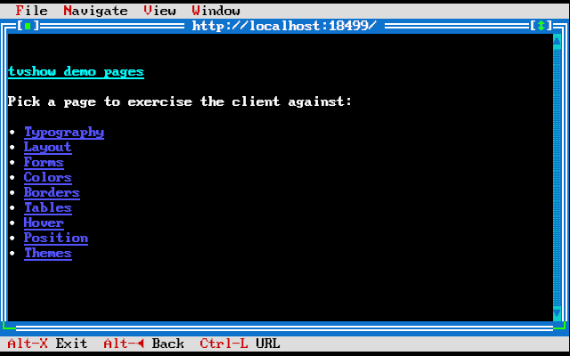
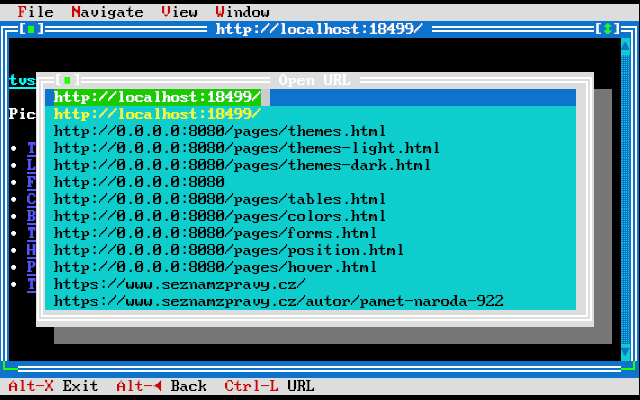
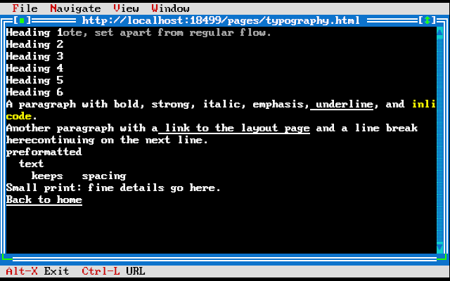
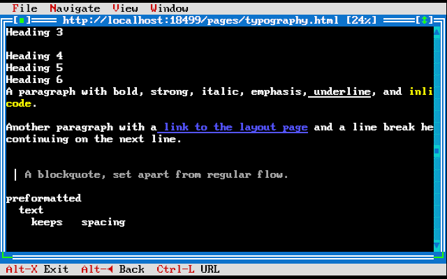
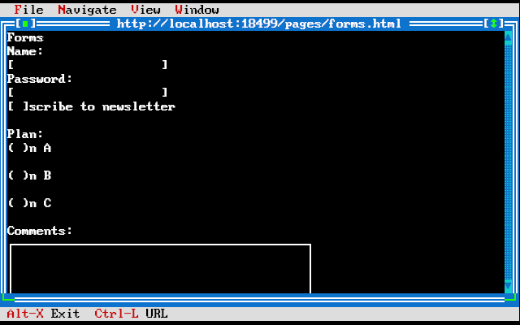

# tvshow — User Guide

tvshow is a terminal web browser. It fetches pages over HTTP, renders HTML+CSS into character cells using box-drawing glyphs and truecolor, and presents them in a TurboVision MDI desktop.

---

## Installation

### Build from source

Requirements: C++20 compiler (GCC ≥ 12 or Clang ≥ 14), CMake ≥ 3.20, Ninja, ncurses development headers.

```sh
git clone https://gitlab.com/tomas.macik/tvshow.git
cd tvshow
cmake --preset debug
cmake --build --preset debug
```

The client binary is at `build/debug/client/tvshow`.

### Optional: demo server

```sh
cmake --build --preset debug --target tvshow-srv
./build/debug/server/tvshow-srv --port 8080
```

---

## Starting tvshow

```sh
# Open a URL directly
./tvshow http://localhost:8080/

# Start with no URL (blank tab)
./tvshow
```

The application opens a TurboVision desktop with a menu bar and status line. Each browser tab is an MDI child window.



---

## Navigation

### Address bar

Press **Ctrl-L** to open the address bar. Type a URL and press Enter to navigate. Press Esc to cancel.

Accepted URL schemes: `http://` and `https://`.



### Links

Tab and Shift-Tab cycle focus through links on the page. The focused link is highlighted. Press **Enter** to follow it.

Mouse clicks on a link also navigate.

### Back and Forward

| Action | Key |
|--------|-----|
| Back | Alt-← |
| Forward | Alt-→ |

Back/Forward navigate the per-tab history stack.

### Reload

Press **Ctrl-R** or **F5** to reload the current page. A spinner animates while loading.

---

## Tabs

| Action | Key |
|--------|-----|
| New tab | Ctrl-T |
| Close tab | Ctrl-W |
| Open URL in current tab | Ctrl-L |

Each tab is an independent MDI window with its own history stack. Use the **Window** menu to switch between open tabs, or use standard TurboVision window controls (Alt-F5 to zoom, Alt-F7 to move, Alt-F8 to resize).



---

## Scrolling

| Action | Key |
|--------|-----|
| Scroll down one row | ↓ |
| Scroll up one row | ↑ |
| Page down | PgDn |
| Page up | PgUp |
| Top of page | Home |
| Bottom of page | End |

The vertical scrollbar on the right edge of each tab reflects the current scroll position.

Fragment links (`#section-id`) scroll directly to the target anchor.



---

## Forms

Tab/Shift-Tab moves focus between form fields. Supported controls:

| Control | Appearance | Interaction |
|---------|------------|-------------|
| Text input | `[ __________ ]` | Type to edit |
| Password | `[ ●●●●●●●●●● ]` | Characters hidden |
| Textarea | Multi-line bordered box | Type to edit, scrolls on overflow |
| Checkbox | `[ ]` / `[x]` | Space to toggle |
| Radio | `( )` / `(•)` | Space to select |
| Select | `[ Option ▾ ]` | Enter opens dropdown |
| Button / Submit | `[ Label ]` | Enter to activate |

Press **Enter** on a submit button (or an `input type="submit"`) to submit the form. GET forms append a query string to the action URL; POST forms send `application/x-www-form-urlencoded`.



---

## Hover

`:hover` CSS styles are supported. Move the mouse over elements to see hover effects (background changes, color changes, border highlights). The browser re-resolves styles and repaints on each hover change.

## Images

An `` tag defaults to showing `[alt text]` in the space reserved by the `width`/`height` attributes. A braille-dot renderer is available for rendering actual image content as Unicode braille patterns (U+2800..U+28FF) when image data is pre-fetched.

---

## Menu reference

| Menu | Items |
|------|-------|
| **≡ tvshow** | About, Quit (Alt-X) |
| **File** | New Tab (Ctrl-T), Open URL (Ctrl-L), Close Tab (Ctrl-W) |
| **Navigate** | Back (Alt-←), Forward (Alt-→), Reload (Ctrl-R), Stop (Esc), Home |
| **View** | Toggle Address Bar, Toggle Status, Cascade, Tile |
| **Window** | List of open tabs |

---

## Keyboard reference

| Key | Action |
|-----|--------|
| Ctrl-L | Open address bar |
| Ctrl-T | New tab |
| Ctrl-W | Close tab |
| Ctrl-R | Reload |
| F5 | Reload |
| Alt-← | Back |
| Alt-→ | Forward |
| Esc | Stop / cancel |
| Tab | Focus next link/control |
| Shift-Tab | Focus previous link/control |
| Enter | Follow link / activate / submit |
| Space | Toggle checkbox/radio |
| ↑ / ↓ | Scroll one row |
| PgUp / PgDn | Scroll one page |
| Home / End | Top / bottom of page |
| Ctrl-D | Toggle debug overlay (box outlines + dimensions) |
| Ctrl-F | Find in page |
| Ctrl-B | Bookmarks |
| Ctrl-C | Copy focused link URL |
| Alt-X | Quit |

---

## Logs and diagnostics

Logs are written to `~/.cache/tvshow/log`. Use `--log-level debug` for verbose output:

```sh
./tvshow --log-level debug http://localhost:8080/
```

---

## Scroll indicator

When a page is taller than the viewport, the window title shows the current scroll position as a percentage (e.g. `[42%]`).

## Debug overlay

Press **Ctrl-D** to toggle box outlines drawn in magenta over the rendered page. Each box shows its dimensions (WxH in cells) at the top-right corner.

---

## Known limitations

- No JavaScript.
- Session cookies only (not persisted across restarts).
- Images default to `[alt]` text (braille renderer requires pre-fetched image data).
- No text selection; Ctrl-C copies the focused link URL only.
- `:hover` applies to the directly hovered element only (not ancestors).
